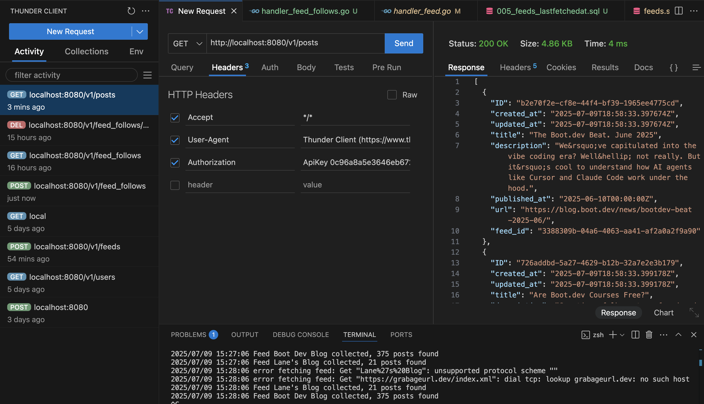
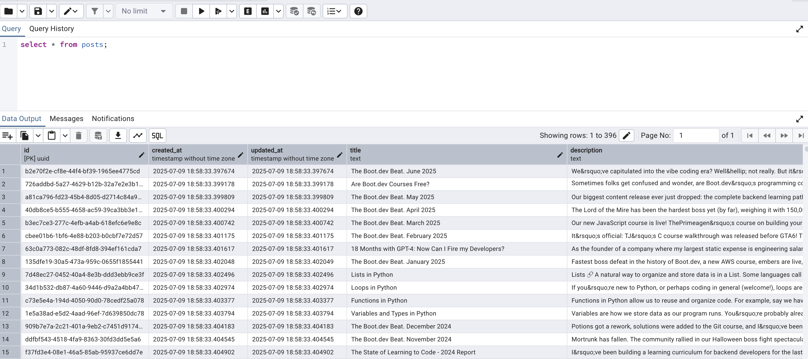

# 📰 RSS Feed Aggregator in Golang

A simple web scraper and RSS feed aggregator built with Go. It fetches and stores posts from various RSS feeds and serves them through a RESTful API.

---

## 🚀 Demo

 

---

## 🙏 Credits

This project was inspired by [Lane Wagner's Golang Web Scraper Tutorial](https://youtu.be/dpXhDzgUSe4).